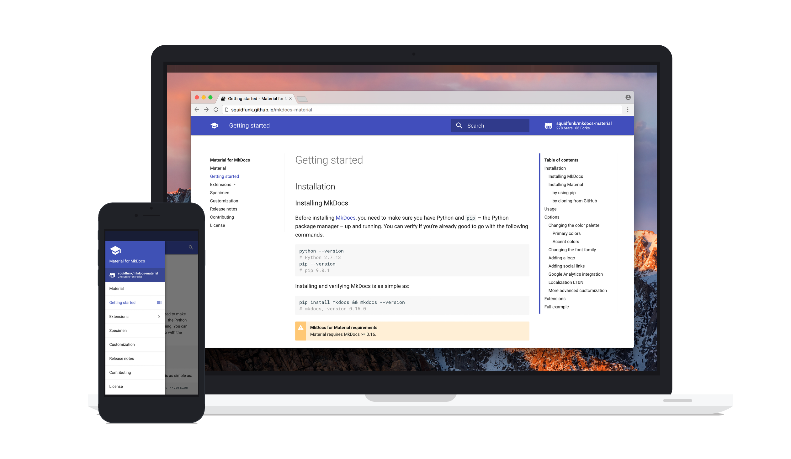

[![Travis][travis-image]][travis-link]
[![Codacy][codacy-image]][codacy-link]
[![Coverage][coverage-image]][coverage-link]
[![npm][npm-image]][npm-link]

  [travis-image]: https://travis-ci.org/docarys/generator-docarys.svg?branch=master
  [travis-link]: https://travis-ci.org/docarys/generator-docarys
  [codacy-image]: https://api.codacy.com/project/badge/Grade/b550877f64f74503b928881dda92c4a1
  [codacy-link]: https://www.codacy.com/app/sesispla/generator-docarys?utm_source=github.com&amp;utm_medium=referral&amp;utm_content=docarys/generator-docarys&amp;utm_campaign=Badge_Grade
  [coverage-image]: https://api.codacy.com/project/badge/Coverage/b550877f64f74503b928881dda92c4a1
  [coverage-link]: https://www.codacy.com/app/sesispla/generator-docarys?utm_source=github.com&utm_medium=referral&utm_content=docarys/generator-docarys&utm_campaign=Badge_Coverage
  [npm-image]: https://img.shields.io/npm/dt/generator-docarys.svg
  [npm-link]: hhttps://www.npmjs.com/package/generator-docarys

# generator-docarys

generator-docarys is the Yeoman generator for [docarys](http://www.docarys.io). 

docarys is yet another static site generator. Simple. Flexible. Customizable. Period.

docarys is as magic as a dragon spitting fire 🐉 🔥

[](https://github.com/docarys/docarys-material)

Based in concepts from mkdocs, hard-forked from mkdocs-material, inspired by Microsoft Docs, and built on top of Node.JS.

## Quick start

Install with `npm`:

``` sh
npm install -g docarys docarys-material generator-docarys
```

To create a new project:
``` sh
mkdir myproject
cd myproject
yo docarys
... (Follow the setup)
docarys serve
```

More details coming soon.

> For detailed installation instructions and a demo, visit (soon) http://www.docarys.io

**MIT License**

Copyright (c) 2017 Sergio Sisternes

Permission is hereby granted, free of charge, to any person obtaining a copy
of this software and associated documentation files (the "Software"), to deal
in the Software without restriction, including without limitation the rights
to use, copy, modify, merge, publish, distribute, sublicense, and/or sell
copies of the Software, and to permit persons to whom the Software is
furnished to do so, subject to the following conditions:

The above copyright notice and this permission notice shall be included in all
copies or substantial portions of the Software.

THE SOFTWARE IS PROVIDED "AS IS", WITHOUT WARRANTY OF ANY KIND, EXPRESS OR
IMPLIED, INCLUDING BUT NOT LIMITED TO THE WARRANTIES OF MERCHANTABILITY,
FITNESS FOR A PARTICULAR PURPOSE AND NONINFRINGEMENT. IN NO EVENT SHALL THE
AUTHORS OR COPYRIGHT HOLDERS BE LIABLE FOR ANY CLAIM, DAMAGES OR OTHER
LIABILITY, WHETHER IN AN ACTION OF CONTRACT, TORT OR OTHERWISE, ARISING FROM,
OUT OF OR IN CONNECTION WITH THE SOFTWARE OR THE USE OR OTHER DEALINGS IN THE
SOFTWARE.
